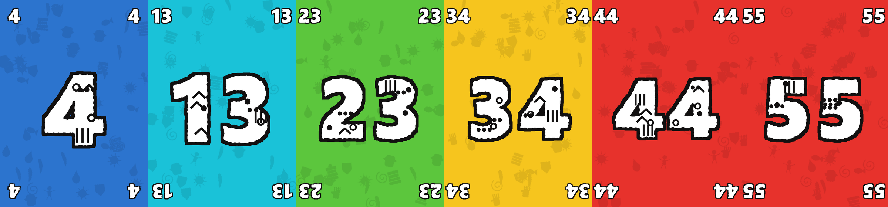

# Pili Pili — Tabletop Simulator

An unofficial, fan-made Tabletop Simulator implementation of **Pili Pili**, the
trick-taking card game with variable missions by **Ben, Martin & JB**, published by
**[ATM Gaming](https://www.atmgaming.com)**.

Not affiliated with or endorsed by ATM Gaming. If you enjoy it, **buy the real game** —
it's a lovely little box, and this exists because the physical game is good.



## Install

```bash
pip install pillow numpy
python build_save.py
```

That renders the card art and writes `PiliPili.json` into your Tabletop Simulator
**Saves** folder. In TTS: **Games → Save & Load → Saves → Pili Pili**.

Card images are served from this repo, so everyone at the table sees them — no Steam
Cloud upload needed. Add `--local` to use local files instead (faster while iterating
on the art, but only you will see them).

| Flag | |
|---|---|
| `--skip-art` | Reuse `assets/`, just rebuild the save. Two seconds instead of two minutes. |
| `--local` | Local `file:///` images. Host-only. |
| `--out DIR` | Write somewhere other than the TTS Saves folder. |
| `--base-url URL` | Serve images from somewhere else entirely. |

## Playing

Sit down in a player colour — the panel top-right only shows rows for occupied seats.

**Mission** flips the next mission, which sets the round's special rule and how many
cards to deal. **Deal** deals that many to everyone. Each player sets a hidden bet with
their row's `-`/`+`, then **Reveal Bets** shows them all — and enforces the rule that
the bets must not total the number of cards dealt, so there's always at least one loser.

Play tricks: highest card wins, no suits, the Joker takes any value from 0 to 56.
Then take 1 Pili for every trick you're away from your bet, using the `-`/`+` or the
physical chillies. **End Round** sweeps the cards back and reshuffles.

First to **6 Pilis** ends the game, and fewest Pilis wins.

Full rules are in the in-game notebook (`Ctrl+N`).

## Missions

The rulebook prints 17 mission **effect types** but not the parameters of each of the
36 physical cards — how many cards each deals, which way the arrows point, which
numbers are cursed. `missions.json` covers all 17 effects with a plausible split of
those parameters. If you have the physical deck and want it exact, edit that file and
rebuild.

## Artwork

Every card is drawn from scratch in code — no scans, photos or exports of the published
game. `glyphs.py` builds tribal glyphs compositionally from silhouettes and ink marks,
seeded per card, and roughens every contour so nothing reads as machine-drawn; `art.py`
lays out the cards. Styled after the published design, but not copied from it.

## Files

| | |
|---|---|
| `build_save.py` | Builds the TTS save. Start here. |
| `art.py` | Card layout, palette, typography. |
| `glyphs.py` | Glyph vocabulary and hand-cut edge treatment. |
| `missions.json` | The 36 mission cards. |
| `global.lua` | Table script — dealing, betting, Pilis, cleanup. |
| `validate.py` | `python validate.py PiliPili.json` — structural check before loading. |
| `preview.py` | Contact sheet of the rendered art. |

## Credits

Pili Pili is designed by **Ben, Martin & JB** and published by
**[ATM Gaming](https://www.atmgaming.com)**. All game design, rules and mission effects
are theirs. This repository contains only an independent digital implementation and
original artwork, shared for personal use.
